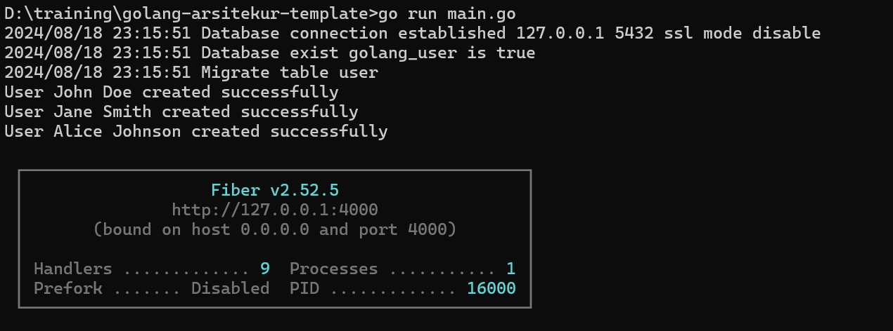
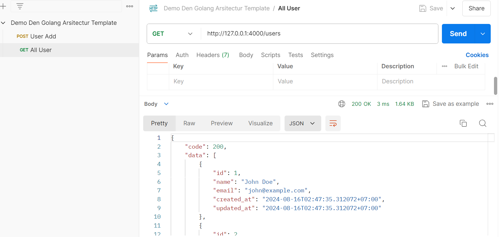
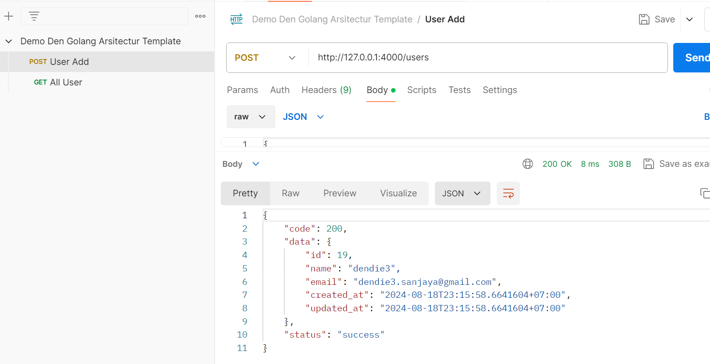
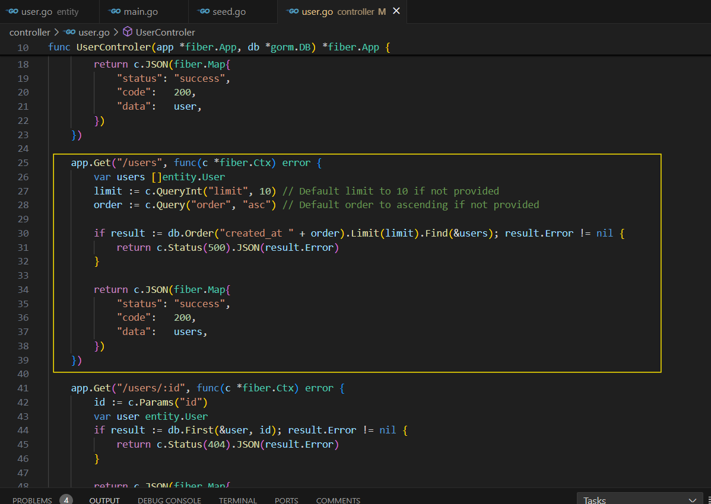
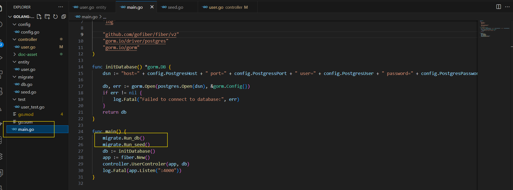
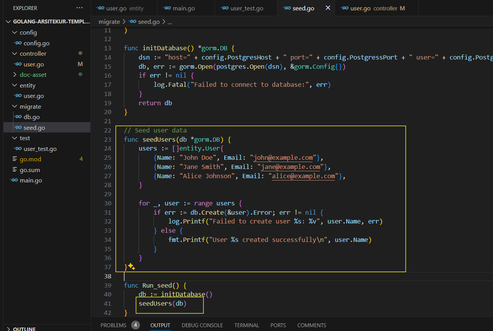
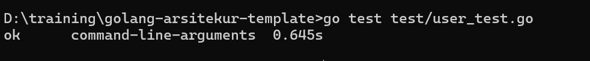

# Den Golang Architecture Template

A golang template architecture using fiber framework version 2, the goal of this architecture is to make it easy to create rest api based services using the golang programming language as easy as using php, nodejs or python

## Structur Directory
<pre><code>
├── config
    └── config.go
├── entity
|   └── *.go
├── migrate
|   └── db.go
    └── seed.go
├── test
|    └── *_test.go
├── main.go
└── README.md
</code></pre>

- Config/config.go  : Place for all global varible configuration 
- Controller/*.go   : Place for all logic process
- Entity/*.entiy    : Place for all model like strukur data
- Migrate/db.go     : Place for auto migration create database and table by reference model  in entity directory
- Migrate/seed.go   : Place for auto populate date di database
- Test              : Place for unit test each controller 

## Installation

Steps to install this framework:

Clone the repository:
  **git clone https://github.com/dendie-sanjaya/golang-arsitekur-template**

## Run App
<pre><code>go mod tidy
go run main.go  
</code></pre>   

## API Postmant 

https://documenter.getpostman.com/view/11442516/2sA3s9D8CR

**Sampe Request Post API**

**Sampe Requeest Get API**

## Simple Guide 

**Create Controller dan Routing URL**

Create URL route and logic as sample this screen shoot below  

**Auto Migrate**

about auto migrate database struktur table and data in file main.go on line 25 and 26, if you dont need this just remove this line or give commet    

**Populate Date**

about auto populate  data in you can write like this 

**Run Unit Test**

For run unit testing, you can type command  

<pre><code>go test test/*_test.go</pre>/<code>

## Contact

If you have question, you can contact this email   
Email: dendie.sanjaya@gmail.com

## License

This project is licensed under the MIT License.
